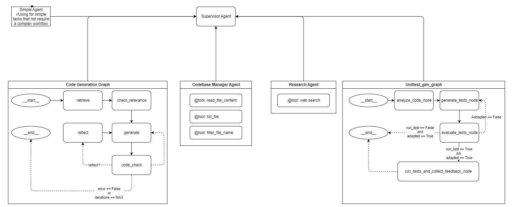

# 🤖 Code Assistant Project

An intelligent code generation and documentation management system designed to supercharge your development workflow using the power of AI. This project aims to provide developers with context-aware code generation, automated unit test generation .etc

<center>

</center>

## ✨ Key Features

  * **🧠 Context-Aware Code Generation:** Leverages Large Language Models (LLMs) to understand your existing codebase and generate relevant, high-quality code snippets, functions, or even entire modules.
  * **🧪 Automated UnitTest Generation:** Automatically creates unit tests for your code, helping to ensure code quality and reduce manual testing efforts.
  * **📚 Intelligent Documentation Assistance:** (Future Goal) Aims to help generate and maintain project documentation.

## 🛠️ Tech Stack

Our project utilizes a robust and modern technology stack:

  * **Backend:** [FastAPI](https://fastapi.tiangolo.com/) 
  * **LLM Integration:** [Google Gemini API](https://ai.google.dev/models/gemini) 
  * **Retrieval Augmented Generation (RAG):**
      * [LangChain](https://www.langchain.com/) 
      * [Langgraph](https://langchain-ai.github.io/langgraph/) 
  * **Vector Database:** [ChromaDB](https://www.trychroma.com/) 
  * **Frontend (Initial):** [Gradio](https://www.gradio.app/) 
## 📋 Prerequisites

Before you begin, ensure you have the following installed:

  * Python (version 3.8 or higher recommended)
  * Git

## ⚙️ Installation

Follow these steps to set up the project locally:

1.  **Clone the Repository:**

    ```bash
    git clone ...
    cd coder
    ```

2.  **Create and Activate a Virtual Environment:**
    It's highly recommended to use a virtual environment to manage project dependencies.

    ```bash
    # For macOS/Linux
    python3 -m venv venv
    source venv/bin/activate

    # For Windows
    python -m venv venv
    venv\Scripts\activate
    ```

3.  **Install Dependencies:**

    ```bash
    pip install -r requirements.txt
    ```

4.  **Set Up Environment Variables:**
    Create a `.env` file in the root directory of the project (e.g., `/coder/.env`). Add your API keys to this file.

    ```env
    # .env
    GOOGLE_API_KEY="YOUR_GOOGLE_API_KEY"
    # OPENAI_API_KEY="YOUR_OPENAI_API_KEY" # If you plan to use OpenAI models as well
    ```

      * **Note:** A `GOOGLE_API_KEY` is essential for the core functionality leveraging the Gemini API.

## 🚀 Quick Start

1.  **Run the Application:**
    Once the dependencies are installed and environment variables are set, start the FastAPI server:

    ```bash
    python src/app.py
    ```

2.  **Access the Application:**
    Open your web browser and navigate to the URL displayed in your terminal. This is typically:
    `http://localhost:7860` (if using the default Gradio port) or `http://127.0.0.1:8000` (if FastAPI is run directly without Gradio serving it). Check your terminal output for the correct address.

## roadmap Future Development

  * **Client-Server Architecture:** Transition from Gradio to a more robust client-server architecture (e.g., React/Vue.js frontend with FastAPI backend).
  * **Enhanced RAG Capabilities:** Improve the retrieval and augmentation process for more accurate and contextually relevant code generation.
  * **Advanced Documentation Features:** Implement automated documentation generation and maintenance tools.
  * **User Authentication & Management:** Add user accounts for personalized experiences.
  * **Expanded LLM Support:** Integrate with other LLMs to offer more choices.
  * **IDE Integration:** Explore plugins for popular IDEs like VS Code.


## 📜 License

This project is licensed under the [MIT License](https://www.google.com/search?q=LICENSE). (You'll need to create a `LICENSE` file, typically with the MIT license text).

## 📧 Contact

If you have any questions, suggestions, or want to get involved, feel free to open an issue on GitHub or reach out to [phanthienvp3@gmail.com](mailto:phanthienvp3@gmail.com).
